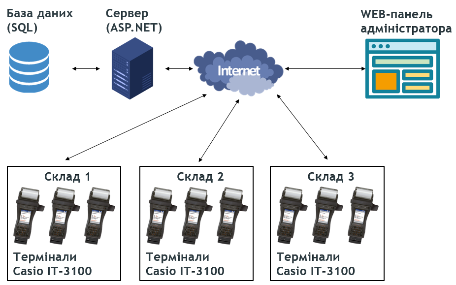
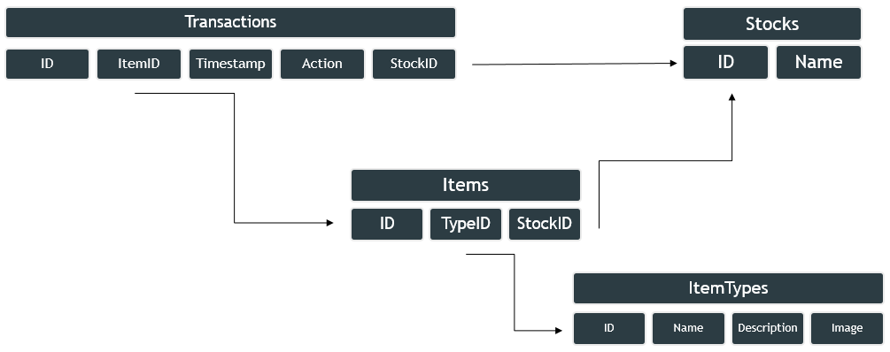
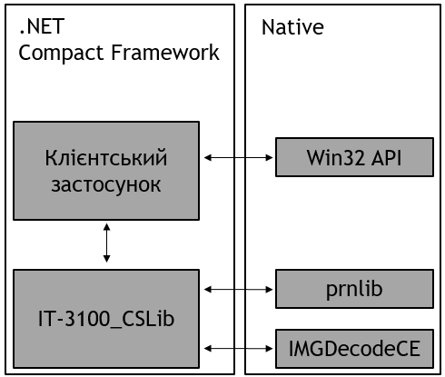
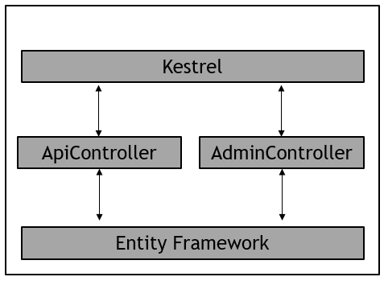

# Розділ 1. Розробка вимог до системи та ПЗ.

## Загальний опис проектованої системи.

Система повинна надавати засоби для обліку та відстеження обігу товарів на складі(складах). 

## Вимоги до функцій та задач.

Система повинна передбачати виконання наступних функцій:

1.	Реєстрація в базі даних списку складів на яких ведется облік та списку типів товарів що підлягають обліку. 
	1.	Список складів повинен містити таку інформацію:
		1.	Номер складу (ID)
		2.	Назва складу
	2.	Список типів товарів повинен містити таку інформацію:
		1.	Номер типу товару (ID)
		2.	Назва типу товару
		3.	Опис типу товару
		4.	Фото типу товару
2.	Закріплення в системі певного аппаратного засобу обліку за складом на якому цей засіб використовуєтся.
3.	Можливість перегляду списку товарів що на даний момент знаходятся на складі у вигляді «Позиція – Кількість»
4.	Можливість реєстрації наджодження товару на склад з присвоєнням йому унікального номера, внесенням в БД інформації про місцезнаходження товару на складі та друкуванням етикетки для товару з штрих-кодом що містить його унікальний номер.
5.	Можливість сканування оператором штрих-коду товару та виконання після цього наступних дій з товаром:
	1.	Перегляд інформації про даний товар, а саме його тип та ID екземпляру.
	2.	Перегляд історії переміщення даного екземпляру товару на складах у вигляді таблиці з такими полями:
		1.	Дата та час операції
		2.	Склад на якому відбулася операція
		3.	Тип операції
	3.	Можливість прийняти даний товар на склад, якщо на даний момент він не закріплений за складом на якому відбулось сканування
	4.	Можливість відпустити товар зі складу, якщо на даний момент він закріплений за складом на якому відбулось сканування
6.	Функція перегляду історії обігу товарів на складі.

---

## Вимоги до видів забезпечення.

### Вимоги до апаратного забезпечення

Необхідно використання наступних аппаратних засобів:

1.	Сервер з ОС Windows або Linux, підтримкою .NET Core 6.0 та доступом в мережу Інтернет. Інші технічні характеристики серверу залежать від кількості терміналів, що підключені до нього.
2.	Термінали Casio IT-3100 у комплектації зі сканером штрих-кодів.
3.	PCMCIA карти розширення для терміналів, що забезпечують з'єднання з мережею Інтернет. Можуть бути використані LAN/WLAN/WWAN карти в залежності від умов в яких використовуєтся конкретний термінал.
Програмні засоби та Інтернет-сервіси:

1.	Для серверу
	1.	ПЗ бази даних. Може бути використана будь-яка SQL-сумісна СКБД що підтримуєтся Entity Framework. Наприклад: Microsoft SQL, PostgreSQL, SQLite, MySQl.
	2.	Середовище виконання .NET Core 6.0 
2.	Для клієнту (терміналів)
	1.	Бібліотека IT-3100_CSLib
	2.	Середовище виконання .NET Compact Framework 3.5
	
# Розділ 2. Розробка архітектури та необхідної проектної документації.

## Загальна архітектура рішення



## Структура бази даних



База даних складаєтся з 4х таблиць:
1. Stocks – містить інформацію про доступні склади
2. ItemTypes – містить перелік типів товарів
3. Items – містить інформацію про наявні товари
4. Transactions – історія операцій з товарами
 
## Архітектура клієнтського ПЗ терміналу

Клієнтський застосунок написано з використанням .NET Compact Framework. 
Роботу з графікою, мережою та введенням даних від користувача покладено на стандартиний Win32 API. 
Робота з специфічним аппаратним забезпеченням відбуваєтся через бібліотеку IT-3100_CSLib що в свою чегру працює напряму з драйверами.



## Архітектура серверного ПЗ

1. Сервер написано на C# з використанням ASP.NET MVC 6 та веб-серверу Kestrel.
2. Підключення до бази даних здійснює Entity Framework
3. Роботу з клієнтськими терміналами та веб-панелью адміністрування виконують відповідно 2 контролери



# Розділ 3. Методика перевірки та засобів тестування.

Передбачаєтся що перед перевіркою проект було розгорнуто на сервер та термінали, використано порожню базу даних та перевірено технічну справність усіх апаратних складових системи за допомогою засобів передбачених виробником. Оскільки всі компоненти системи тісно пов`язані між собою, їх перевірка повинна відбуватися в суворо визначеній послідовності, що зазначено нижче.

1.	Перевірка функціоналу WEB-панелі
	1.	Перейти у WEB-панель в браузері
	2.	Перевірити що в системі відсутні склади та типи товарів
	3.	Створити щонайменьше 3 склади та два типи товарів. До одного з типів товарів додати зображення під час створення. Перевірити правильність створених об'єктів.
	4.	Видалити один склад та один тип товару. Перевірити що з системи було видалені ці об'єкти.
2.	Перевірка функціоналу реєстрації терміналу в системі
	1.	Запустити на терміналі клієнтський застосунок
	2.	У меню вікон вибрати вікно «Вхід в систему»
	3.	В поле для введення адреси серверу ввести адресу серверу
	4.	Натиснути кнопку «З'єднати». Дочекатися встановлення з'єднання з сервером. Після з'єднання з'явится список доступних складів.
	5.	Обрати зі списку потрібний склад. Натиснути кнопку «Увійти в систему»
	6.	Перевірити що в головному меню вказана назва обраного складу та список товарів на складі порожній.
3.	Перевірка функціоналу реєстрації нового екземпляру товару в системі
	1.	В головному меню натиснути кнопку «Новий товар»
	2.	У вікні, що відкрилося, обрати тип товару.
	3.	Натиснути кнопку «Зареєструвати»
	4.	Принтер терміналу повинен надрукувати етикетку з наступними елементами:
		1.	Назва типу тоавру (повинна збігатися с обраним типом)
		2.	Склад на якому прийнято товар (повинен збігатися зі складом, на якому зареєстровано термінал)
		3.	Штрих-код з ID товару.
		4.	(Опціонально) Логотип компанії
	5.	Відірвати надруковану етикетку
	6.	Перевірити що в головному меню з'явилася інформація про новий товар
	7.	Піднести етекетку до сканера та натиснути кнопку сканування(помаранчеві клавіші з боків терміналу)
	8.	Термінал повинен відтворити звуковий сигнал та відкрити вікно з інформацією про товар. Якщо цього не відбулося – повторювати попередній етап змінивши відстань між сканером та етикеткою та орієнтацію етикетки.
	9.	У вікні перевірити що інформація про товар (назва та ID) збігаются з інформацією на етикетці.
	10.	Перевірити що в історії руху товару є рівно один запис про прийняття товару на склад.
4.	Перевірка функціоналу видачі та прийняття зареєстрованного товару на склад
	1.	У вікні натиснути кнопку «Видати».
	2.	Перевірити що в головному меню зник запис про цю одиницю товару
	3.	Повторно відсканувати етикетку.
	4.	Перевірити що в історії з'явився запис про видачу товару.
	5.	Перевірити що стала доступна кнопка прийняття товару на склад.
	6.	Натиснути кнопку «Прийняти» 
	7.	Перевірити що в головному меню поновився запис про цю одиницю товару.
	8.	Повторно відсканувати етикетку
	9.	Перевірити що в історії з'явився запис про прийняття товару.
	10.	Закрити вікно кнопкою «Скасувати»
5.	Перевірка функціоналу перегляду звіту про рух товару на складі
	1.	В головному меню натиснути кнопку «Типи товарів»
	2.	Обрати тип товару, що використовувався під час попередніх кроків.
	3.	Натиснути кнопку «Звіт»
	4.	Перевірити що у вікні, що відкрилося, містится 3 записи:
		1.	Запис про первинне прийняття(реєстрацію нового екземпляру) товару
		2.	Запис про видачу товару
		3.	Запис про повторне прийняття товару
		
# Розділ 4. Розробка та налагодження програмного забезпечення та супровідної документації.

Вихідні коди ПЗ проекту розміщені у публічному репозиторії на GitHub:
https://github.com/AlexCatze/StockManager

## Серверне програмне забезпечення
Серверне ПЗ написано на базі ASP.NET MVC 6 та являє собою HTTP сервер. 
Підключення до бази даних покладено на Entity Framework.  
За приймання HTTP запитів відповідає Kestrel. Далі за обробку даних відповідають два контролери. 
AdminController – за обробку даних отриманих під час використання WEB-панелі. 
ApiController – за обробку даних отриманих від клієнтських терміналів. 
Контролери опрацьовують отримані запити, виконують дії з базою даних на повертають передбачений результат. 
У випадку виникнення помилки під час виконання запиту буде повернено відповідний HTTP Status Code.

---

```csharp 
[HttpPost("Admin/AddStock")]
public async Task<IActionResult> AddStock(string name, CancellationToken cancellationToken = default)
{
    _context.Stocks.Add(new Stock { Name = name });
    await _context.SaveChangesAsync();
    return Redirect("/");
}
```

*Фрагмент коду AdminController що відповідає за обробку запиту на реєстрацію складу*

---

```html
<h2>Додати</h2>
<form method="POST" action="/Admin/AddStock" >
    <label>Назва: </label>
    <input type="text" name="name" id="name" />
    <input type="submit"/>
</form>
<table border="1" width="100%">
    <tr><th>Назва</th><th>ID</th><th>Дії</th></tr>
    @foreach(Stock stock in db.Stocks)
    {
        <tr>
            <td>@stock.Name</td>
            <td>@stock.Id</td>
            <td><a href="/Admin/RemoveStock?id=@(stock.Id)">Видалити</a></td>
        </tr>
    }
</table>
```

*Фрагмент коду CsHTML сторінки адміністрування, що відповідає за керування складами*

---

```csharp 
[HttpPost("Api/GetItemsOnStock")]
public async Task<IActionResult> GetItemsOnStock(CancellationToken cancellationToken = default)
{
    string body;
    using (var reader = new StreamReader(Request.Body))
        body = await reader.ReadToEndAsync();
    Stock stock;
    try
    {
        stock = JsonSerializer.Deserialize<Stock>(body);
    }
    catch (Exception ex) { return BadRequest(); }

    var result = await _context.Items.Where(t => t.StockId == stock.Id).ToListAsync();

    return Ok(JsonSerializer.Serialize(result));
}
```
 
*Фрагмент коду ApiController, що відповідає за повернення списку всіх товарів на певному складі.*
 
---

## Клієнтське програмне забезпечення
Клієнтське ПЗ написано з використанням .NET Compact Framework 3.5. 
Графічний інтерфейс побудовано на Windows Forms. Для зручної роботи з серверним Api, був написаний проксі-клас ServerConnector. 
Робота зі специфічним апаратним забезпеченням (сканер штрих-кодів та термопринтер) відбуваєтся через бібліотеку IT-3100_CSLib. 

```csharp 
public ReportForm(ThingType type)
{
    InitializeComponent();

    DataTable table = new DataTable();
    table.Columns.Add("ID товару");
    table.Columns.Add("Дата та час");
    table.Columns.Add("Дія");

    List<ItemTransaction> types = ServerConnector.GetTypeStockTransactions(new StockType {Stock = MainForm.MyStock, ThingType = type });

    if (types != null)
        foreach (ItemTransaction t in types)
            table.Rows.Add(t.ItemId, t.Timestamp.ToString("dd/MM/yyyy HH:mm:ss"), t.Count > 0 ? "Прийнято" : "Відпущено");

    dataGrid1.DataSource = table;
}
```

*Фрагмент коду, конструктор форми звіту про рух певного типу товару на складі*

---

```csharp 
private static string Request(string endpoint, string body)
{
    try
    {
        if(!server_address.EndsWith("/")) server_address+="/";
        WebRequest request = WebRequest.Create(server_address + endpoint);
        request.Method = "POST";

        if (body != null)
        {
            UTF8Encoding encoding = new UTF8Encoding();
            byte[] data = encoding.GetBytes(body);
            request.ContentLength = data.Length;
            using (var stream = request.GetRequestStream())
                stream.Write(data,0,data.Length);
        }

        using (WebResponse response = request.GetResponse())
        using (Stream dataStream = response.GetResponseStream())
        using (StreamReader reader = new StreamReader(dataStream))
        {
            string responseFromServer = reader.ReadToEnd();
            return responseFromServer;
        }
    }
    catch (Exception ex)
    {
        ShowWebError(ex);
        return null;
    }
}
```

*Фрагмент коду, що виконує всі запити до сервера*

---

```csharp 
public static List<Item> GetItemsOnStock(Stock stock)
{
    string res = Request("Api/GetItemsOnStock", JsonConvert.SerializeObject(stock));
    if (res == null) return null;
    return JsonConvert.DeserializeObject<List<Item>>(res);
}
```

*Функція-обгортка для запиту на отримання списку товарів на складі*

---

```csharp 
MainForm.CheckStatus(PrinterLib.PRNTextOut("Товар: " + types[comboBox1.SelectedIndex].Name));
MainForm.CheckStatus(PrinterLib.PRNTextOut("Склад прийняття: " + MainForm.MyStock.Name));

string barcode = item.Id.ToString();
while (barcode.Length < 12)
    barcode = "0"+barcode;
                MainForm.CheckStatus(PrinterLib.PRNBarcodeOut(PrinterLib.codeType.Code128, 20, true, PrinterLib.fontType.ANK8x16, 0, PrinterLib.direction.VERTICAL, barcode));

string path = Path.Combine(Path.GetDirectoryName(Assembly.GetExecutingAssembly().GetName().CodeBase), "logo.bin");

if (File.Exists(path))
{
    FileStream file = File.OpenRead(path);
    byte[] data = new byte[(int)file.Length];
    file.Read(data, 0, (int)file.Length);
    file.Close();
    if (data.Length % 72 == 0)
        MainForm.CheckStatus(PrinterLib.PRNImageOut(72, (uint)(data.Length / 72), 10, data));
}

MainForm.CheckStatus(PrinterLib.SkipLines(3));
```

*Фрагмент коду, що виконує друк етикетки*

---

## Використана під час розробки документація

1.	ASP.NET overview - [https://learn.microsoft.com/en-us/aspnet/overview](https://learn.microsoft.com/en-us/aspnet/overview)
2.	Entity Framework documentation hub - [https://learn.microsoft.com/en-us/ef/](https://learn.microsoft.com/en-us/ef/)
3.	Common Device Control Library. Manual For Developers. - CASIO Computer Co., Ltd. 
4.	IT-3000 Series .NET Library Manual - CASIO Computer Co., Ltd.
5.	.NET Compact Framework MSDN library
